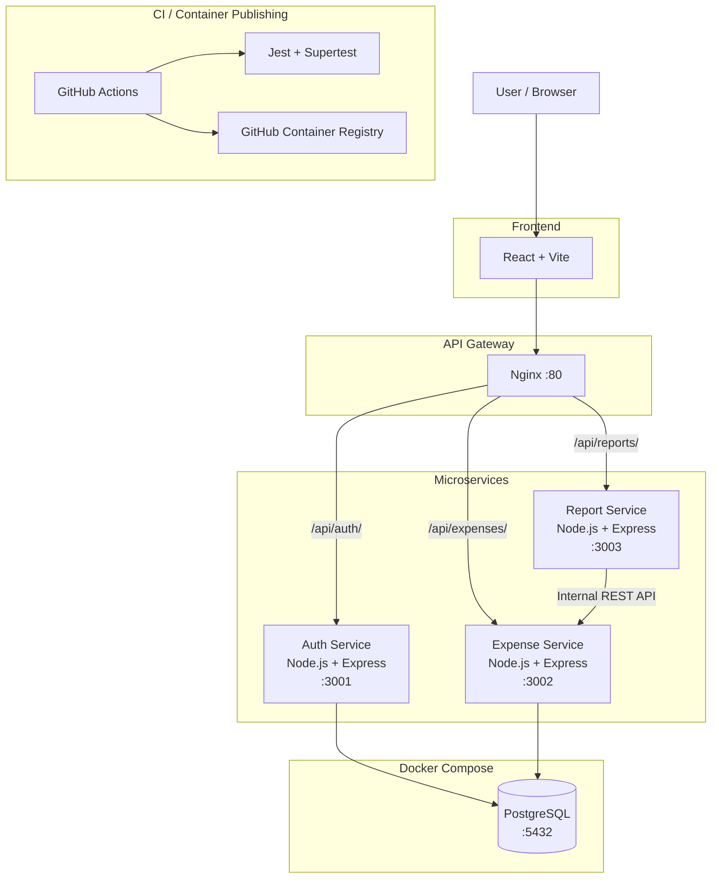
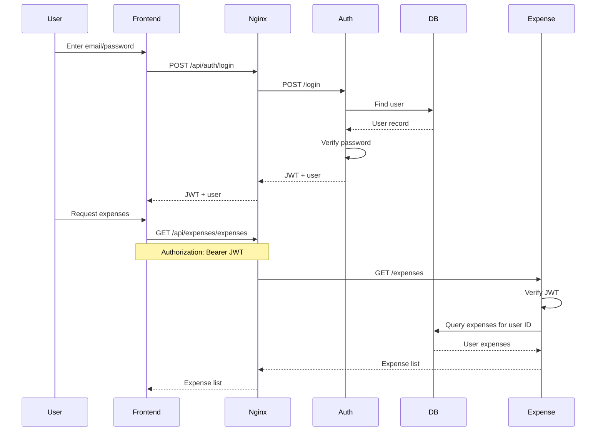
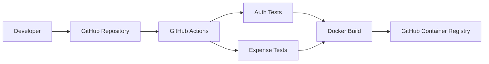

# Expense Tracker Architecture

## High-Level Architecture



## Components

### React Frontend

The React frontend provides the user interface for:

* Signup
* Login
* Viewing expenses
* Creating expenses
* Editing expenses
* Deleting expenses
* Reporting
* Logout

The frontend communicates with backend services through Nginx.

### Nginx API Gateway

Nginx provides a single backend entry point.

```text
/api/auth/       → auth-service:3001
/api/expenses/   → expense-service:3002
/api/reports/    → report-service:3003
```

This keeps the frontend independent from internal service addresses.

### Auth Service

Technology:

```text
Node.js
Express
PostgreSQL
JWT
bcryptjs
```

Responsibilities:

* User registration
* Password hashing
* User login
* JWT generation
* JWT verification

The JWT contains the authenticated user's ID and email.

### Expense Service

Technology:

```text
Node.js
Express
PostgreSQL
JWT
```

Responsibilities:

* Create expenses
* Read expenses
* Update expenses
* Delete expenses
* Authenticate requests
* Restrict expense operations to the authenticated user

The Express application setup is separated from server startup using `app.js` and `index.js`, allowing the application to be tested with Supertest.

### Report Service

Technology:

```text
Node.js
Express
```

The Report Service handles reporting functionality as an independent service.

It communicates internally with the Expense Service through the Docker Compose network:

```text
http://expense-service:3002
```

### PostgreSQL

PostgreSQL stores application data.

Current tables include:

```text
users
expenses
```

A Docker named volume provides persistent database storage:

```text
postgres-data
```

## Authentication Flow



## Expense Data Isolation

The Expense Service extracts the authenticated user's ID from the JWT.

Database operations use that ID:

```sql
WHERE user_id = $1
```

For example:

```text
JWT
 |
 +-- id: 1
 |
 v
Expense Service
 |
 v
WHERE user_id = 1
```

This ensures expense operations are scoped to the authenticated user.

## Docker Network

Docker Compose allows services to communicate using service names.

For example:

```text
auth-service
expense-service
report-service
db
```

The Report Service communicates with the Expense Service using:

```text
http://expense-service:3002
```

The browser accesses the application through the exposed host ports.

## CI/CD Architecture



The CI pipeline runs automated tests before Docker images are built and published.

Images are built for:

```text
Auth Service
Expense Service
Report Service
Frontend
```

## Local Deployment Model

```text
                    Host Machine
                         |
                  Docker Compose
                         |
        +----------------+----------------+
        |                |                |
     Nginx             Services        PostgreSQL
      :80                |                 :5432
        |                |
        |       +--------+--------+
        |       |        |        |
        |      Auth   Expense   Report
        |      :3001   :3002     :3003
        |
     Frontend
       :5173
```

Frontend:

```text
http://localhost:5173
```

API gateway:

```text
http://localhost
```

## Project Structure

```text
expense-tracker/
│
├── auth-service/
├── expense-service/
├── report-service/
├── frontend/
├── nginx/
├── .github/
│   └── workflows/
├── docker-compose.yml
├── README.md
├── API.md
└── ARCHITECTURE.md
```

## Architectural Goals

This project demonstrates:

* Microservice separation
* REST API communication
* JWT authentication
* PostgreSQL persistence
* Docker containerization
* Docker Compose orchestration
* Nginx API gateway routing
* Internal service-to-service communication
* Automated testing
* GitHub Actions CI
* Container image publishing
