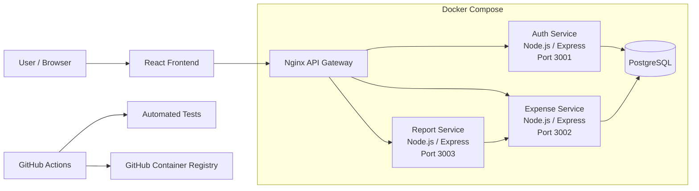

# Expense Tracker — Microservices Demo

A full-stack expense tracking application built to demonstrate a practical microservices architecture using Node.js, Express, React, PostgreSQL, Docker, Nginx, JWT authentication, automated testing, and GitHub Actions.

## Features

* User signup and login
* JWT-based authentication
* Password hashing with bcrypt
* User-specific expense data
* Create, read, update, and delete expenses
* Expense categories
* Reporting service
* React frontend
* Nginx API gateway
* PostgreSQL with persistent Docker storage
* Jest and Supertest automated tests
* GitHub Actions CI
* Docker image publishing to GitHub Container Registry

## Architecture



## Tech Stack

### Frontend

* React
* Vite
* Axios
* React Router

### Backend

* Node.js
* Express.js
* REST APIs
* JWT
* bcryptjs

### Database

* PostgreSQL

### DevOps

* Docker
* Docker Compose
* Nginx
* GitHub Actions
* GitHub Container Registry

### Testing

* Jest
* Supertest

## Services

| Service         | Port | Purpose                           |
| --------------- | ---: | --------------------------------- |
| Auth Service    | 3001 | Signup, login, JWT authentication |
| Expense Service | 3002 | Expense CRUD operations           |
| Report Service  | 3003 | Reporting functionality           |
| Nginx           |   80 | API gateway                       |
| PostgreSQL      | 5432 | Application data                  |

## API Gateway

The frontend communicates with the backend through Nginx:

```text
/api/auth/       → auth-service:3001
/api/expenses/   → expense-service:3002
/api/reports/    → report-service:3003
```

## Authentication Flow

```text
User
  |
  | Login
  v
React Frontend
  |
  v
Nginx
  |
  v
Auth Service
  |
  | JWT
  v
Frontend
  |
  | Authorization: Bearer <JWT>
  v
Expense Service
  |
  v
PostgreSQL
```

## Running Locally

### Clone the repository

```bash
git clone https://github.com/Dhyey1234/expense-tracker.git
cd expense-tracker
```

### Start the application

```bash
docker compose up -d --build
```

### Check containers

```bash
docker compose ps
```

### Open the frontend

```text
http://localhost:5173
```

## Health Checks

Auth Service:

```bash
curl http://localhost:3001/
```

Expense Service:

```bash
curl http://localhost:3002/
```

Through Nginx:

```bash
curl http://localhost/api/expenses/
```

## Testing

Run Expense Service tests:

```bash
cd expense-service
npm install
npm test
```

The tests cover authentication middleware, expense endpoints, validation, successful operations, not-found handling, and database-error handling.

## CI/CD

GitHub Actions runs when changes are pushed to `main` or when a pull request targets `main`.

The workflow:

1. Checks out the repository
2. Sets up Node.js
3. Installs dependencies
4. Runs Auth Service tests
5. Runs Expense Service tests
6. Builds Docker images
7. Publishes Docker images to GitHub Container Registry

## Project Structure

```text
expense-tracker/
│
├── auth-service/
│   ├── index.js
│   ├── package.json
│   ├── Dockerfile
│   └── .env
│
├── expense-service/
│   ├── app.js
│   ├── index.js
│   ├── middleware/
│   │   └── auth.js
│   ├── tests/
│   ├── package.json
│   └── Dockerfile
│
├── report-service/
│   ├── index.js
│   ├── package.json
│   └── Dockerfile
│
├── frontend/
│   ├── src/
│   ├── package.json
│   └── Dockerfile
│
├── nginx/
│   └── nginx.conf
│
├── .github/
│   └── workflows/
│       └── ci.yml
│
├── docker-compose.yml
├── README.md
├── API.md
└── ARCHITECTURE.md
```

## Design Decisions

### Microservices

Authentication, expense management, and reporting are separated into independent services.

### API Gateway

Nginx provides a single entry point for frontend API requests and routes them to the appropriate backend service.

### JWT Authentication

The Auth Service issues JWTs after successful authentication. Protected services validate the token before processing requests.

### User Isolation

Expense operations use the authenticated user's ID so users only access their own expenses.

### PostgreSQL

PostgreSQL stores persistent user and expense data. A Docker volume preserves database data across container restarts.

### Testable Application Structure

The Expense Service separates Express application setup from server startup using `app.js` and `index.js`. This makes the service easier to test with Supertest.

## Security

* Passwords are hashed using bcrypt
* JWTs protect authenticated endpoints
* SQL queries use parameterized values
* Expense operations are restricted to the authenticated user
* Authentication secrets are stored using environment variables

## Future Improvements

* Expand automated test coverage
* Add stronger request validation
* Expand reporting functionality
* Add production configuration
* Deploy to a cloud VM
* Add automated deployment through GitHub Actions
* Add monitoring and centralized logging

## License

This project is intended as a portfolio and learning project.
